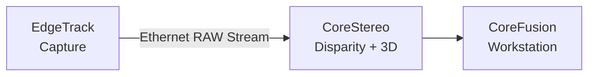
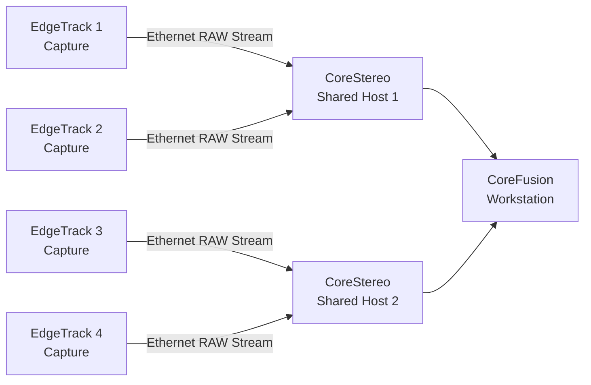
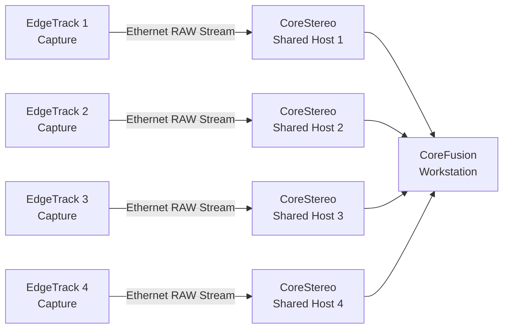

# CoreStereo

**High-performance host-side stereo processing for deterministic, geometry-first 3D reconstruction.**

---

## Overview

CoreStereo is a host-side stereo processing module within the EdgeTrack architecture. It is responsible for converting synchronized stereo image streams into disparity, depth, and local 3D representations.

The system is designed around a **RAW-first, geometry-driven approach**, prioritizing **deterministic behavior, reproducibility, and transparency** over black-box inference.

CoreStereo is optimized for modern multi-core CPUs and supports scalable deployment across multiple stereo rigs.

---

## Key Features

* **Host-side stereo processing (CPU-first)**
* **Full dense and ROI-based disparity estimation**
* **RAW-first, zero-copy pipeline design**
* **Deterministic, geometry-based reconstruction**
* **Multi-threaded and SIMD-optimized execution**
* **Scalable across multiple independent stereo nodes**
* **Optional GPU acceleration for advanced workloads**

---

## Architecture Role

CoreStereo operates between **EdgeTrack (capture)** and **CoreFusion (multi-rig fusion)**:



* **EdgeTrack** → provides synchronized RAW stereo data
* **CoreStereo** → computes disparity and local 3D reconstruction
* **CoreFusion** → merges multiple rigs into a unified scene

---

Additional architectural variants can also be considered, for example:


However, this is not the preferred setup.

The recommended architecture is this:




## Processing Pipeline

```text
Sensor → Rectification → Stereo Matching (Disparity) → Depth / 3D → CoreFusion
```

### Notes

* **Stereo matching is the primary computational bottleneck**
* Post-processing is intentionally minimized at this stage
* Multi-view filtering and refinement are handled in CoreFusion

---

## Performance Considerations

Dense stereo matching scales rapidly with resolution, disparity range, and frame rate:

> **O(width × height × disparity × FPS)**

This leads to billions of candidate evaluations per second at high resolutions.

### Optimization Strategies

* Reduce **disparity range** (e.g., 64–96 instead of 128+)
* Use **ROI-based processing** for motion-critical regions
* Apply **dual-resolution pipelines**
* Optimize for **SIMD (AVX2)** and multi-threading
* Maintain **cache-friendly memory layout**
* Minimize memory copies (zero-copy design)

---

## Hardware Requirements

### Minimum (1 Stereo Pair)

* CPU: Ryzen 5 (e.g., 5600X / 5600G)
* RAM: 32 GB DDR4
* Network: 1–2.5 GbE

### Recommended

* CPU: Ryzen 7 (5700X / 5800X)
* RAM: 32–64 GB
* Network: 2.5–10 GbE

### High-End Target

* CPU: Ryzen 9 (e.g., 7950-class)
* RAM: 64 GB+
* DDR5 recommended
* High-bandwidth network (10 GbE)

---

## Performance Targets

| Configuration      | Expected Performance                 |
| ------------------ | ------------------------------------ |
| 1280×800 @ 30 FPS  | ✔ Stable (Ryzen 5+)                  |
| 1280×800 @ 60 FPS  | ⚠ Requires optimization (Ryzen 7+)   |
| 1280×800 @ 120 FPS | 🚧 High-end CPU + optimized pipeline |

> High-end desktop CPUs (e.g., Ryzen 9 7950-class) can approach real-time processing at very high frame rates when combined with optimized stereo pipelines and controlled disparity ranges.

---

## Design Philosophy

CoreStereo follows a **geometry-first approach**:

* No dependency on AI inference
* Deterministic output
* Transparent processing pipeline
* Reproducible results
* Hardware-agnostic design

AI-based methods (e.g., neural stereo) are optional and can be integrated as complementary modules.

---

## Advantages

* Full control over stereo pipeline
* High precision and reproducibility
* Scalable architecture (multi-node)
* Works with low-cost capture hardware
* Not tied to vendor ecosystems

---

## Trade-offs

* Higher hardware requirements compared to embedded systems
* CPU-intensive processing
* Requires careful optimization for high FPS

---

## License

Apache-2.0 (planned)

---

## Status

🟡 Planned / In development

---

## Related Modules

* **EdgeTrack** – Capture, synchronization, and streaming
* **CoreFusion** – Multi-rig fusion and scene reconstruction

---